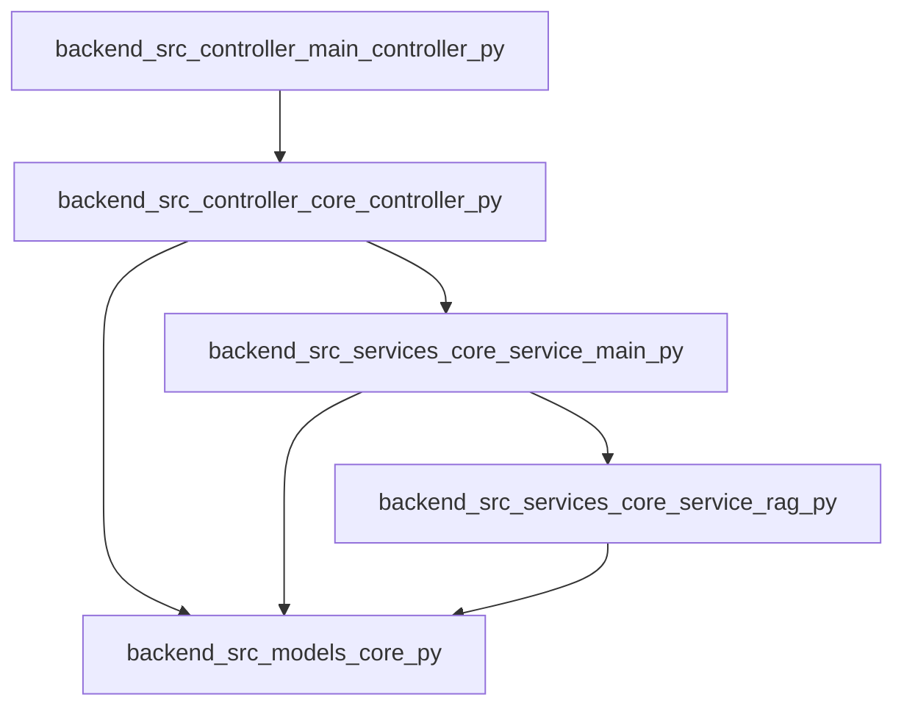

# GNOST — Project Onboarding Guide

_Generated automatically by GNOST._

## Project Overview

- **Root:** `/Users/mohdzain/Documents/GitHub/surfmind`
- **Languages:** python (22), javascript (14)
- **Framework:** FastAPI

## Entry Points

- `backend/src/controller/main_controller.py` — FastAPI app initialization
- `src/index.js` — Common JS entry filename
- `src/App.js` — Common JS entry filename

## Execution Flow (High Level)

- `backend/src/controller/main_controller.py` → `backend/src/controller/core_controller.py` → `backend/src/services/core_service/main.py` → `backend/src/services/core_service/rag.py` → `backend/src/models/core.py`
- `backend/src/controller/main_controller.py` → `backend/src/controller/core_controller.py` → `backend/src/services/core_service/main.py` → `backend/src/models/core.py`
- `backend/src/controller/main_controller.py` → `backend/src/controller/core_controller.py` → `backend/src/models/core.py`
- `src/App.js`
- `src/index.js`

## Execution Flow Diagram

## Recommended Reading Order

### Start Here

- `backend/src/controller/main_controller.py`
- `src/App.js`
- `src/index.js`

### Core Logic

- `backend/src/controller/core_controller.py`
- `backend/src/services/core_service/main.py`
- `backend/src/services/core_service/rag.py`

### Supporting / Leaf Code

- `backend/src/models/core.py`
- `src/App.js`
- `src/index.js`
