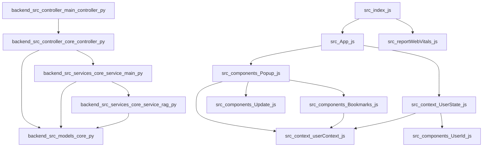

# surfmind — Project Onboarding Guide

_Generated automatically by GNOST._

## Project Overview

- **Root:** `/Users/mohdzain/Documents/GitHub/surfmind`
- **Languages:** python (22), javascript (14)
- **Framework:** FastAPI

## Entry Points

- `backend/src/controller/main_controller.py` — FastAPI app initialization
- `src/index.js` — Common JS entry filename
- `src/App.js` — Common JS entry filename

## Execution Flow (High Level)

- `src/App.js` → `src/components/Popup.js` → `src/context/userContext.js`
- `src/App.js` → `src/components/Popup.js` → `src/components/Bookmarks.js` → `src/context/userContext.js`
- `src/App.js` → `src/components/Popup.js` → `src/components/Update.js`
- `src/App.js` → `src/context/UserState.js` → `src/context/userContext.js`
- `src/App.js` → `src/context/UserState.js` → `src/components/UserId.js`

_(9 additional paths omitted for clarity.)_

## Execution Flow Diagram

```mermaid
flowchart TD
  src_App_js --> src_components_Popup_js
  backend_src_controller_core_controller_py --> backend_src_models_core_py
  src_components_Popup_js --> src_context_userContext_js
  src_components_Popup_js --> src_components_Update_js
  backend_src_controller_main_controller_py --> backend_src_controller_core_controller_py
  backend_src_controller_core_controller_py --> backend_src_services_core_service_main_py
  backend_src_services_core_service_main_py --> backend_src_models_core_py
  src_context_UserState_js --> src_context_userContext_js
  src_index_js --> src_App_js
  backend_src_services_core_service_main_py --> backend_src_services_core_service_rag_py
  backend_src_services_core_service_rag_py --> backend_src_models_core_py
  src_App_js --> src_context_UserState_js
  src_context_UserState_js --> src_components_UserId_js
  src_index_js --> src_reportWebVitals_js
  src_components_Popup_js --> src_components_Bookmarks_js
  src_components_Bookmarks_js --> src_context_userContext_js
```

## Recommended Reading Order

### Start Here

- `backend/src/controller/main_controller.py`
- `src/App.js`
- `src/index.js`

### Core Logic

- `backend/src/controller/core_controller.py`
- `backend/src/services/core_service/main.py`
- `backend/src/services/core_service/rag.py`
- `src/App.js`
- `src/components/Bookmarks.js`
- `src/components/Popup.js`
- `src/context/UserState.js`

### Supporting / Leaf Code

- `backend/src/models/core.py`
- `src/components/Update.js`
- `src/components/UserId.js`
- `src/context/userContext.js`
- `src/reportWebVitals.js`
